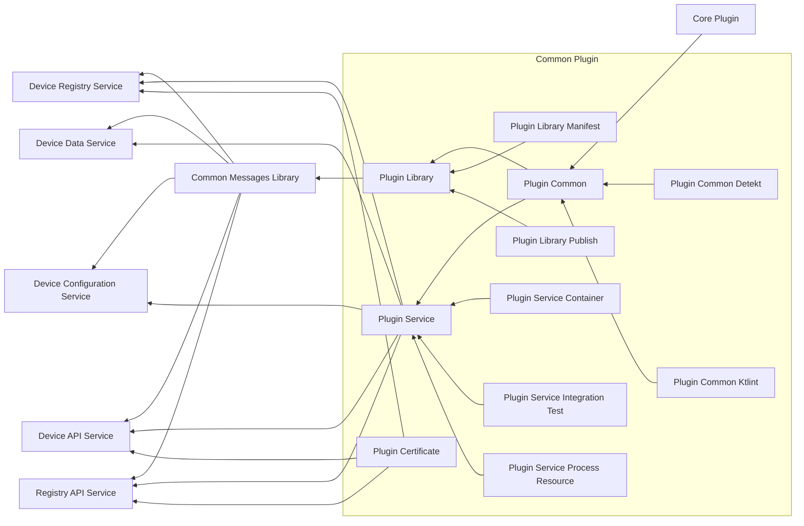

# Hlæja structure

```mermaid
graph RL;
  CP[Core Plugin]
  subgraph SCP [Common Plugin]
    PL[Plugin Library]
    PLM[Plugin Library Manifest]
    PLP[Plugin Library Publish]
    PCo[Plugin Common]
    PCoD[Plugin Common Detekt]
    PCoK[Plugin Common Ktlint]
    PS[Plugin Service]
    PSC[Plugin Service Container]
    PSIT[Plugin Service Integration Test]
    PSPR[Plugin Service Process Resource]
    PCe[Plugin Certificate]
  end
  PCo --> PL
  PLM --> PL
  PLP --> PL
  CP --> PCo
  PCoD --> PCo
  PCoK --> PCo
  PCo --> PS
  PSC --> PS
  PSIT --> PS
  PSPR --> PS
  CML[Common Messages Library]
  PL --> CML
  DRS[Device Registry Service]
  CML --> DRS
  PS --> DRS
  PCe --> DRS
  DDS[Device Data Service]
  CML --> DDS
  PS --> DDS
  DCS[Device Configuration Service]
  CML --> DCS
  PS --> DCS
  DAS[Device API Service]
  CML --> DAS
  PS --> DAS
  PCe --> DAS
  RAS[Registry API Service]
  CML --> RAS
  PS --> RAS
  PCe --> RAS
```
