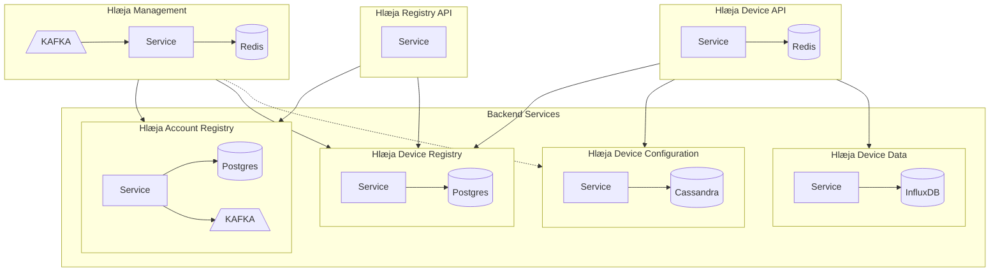
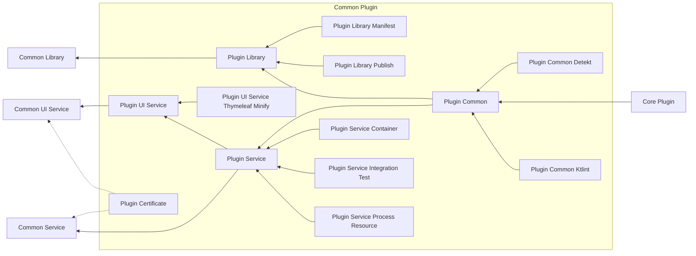
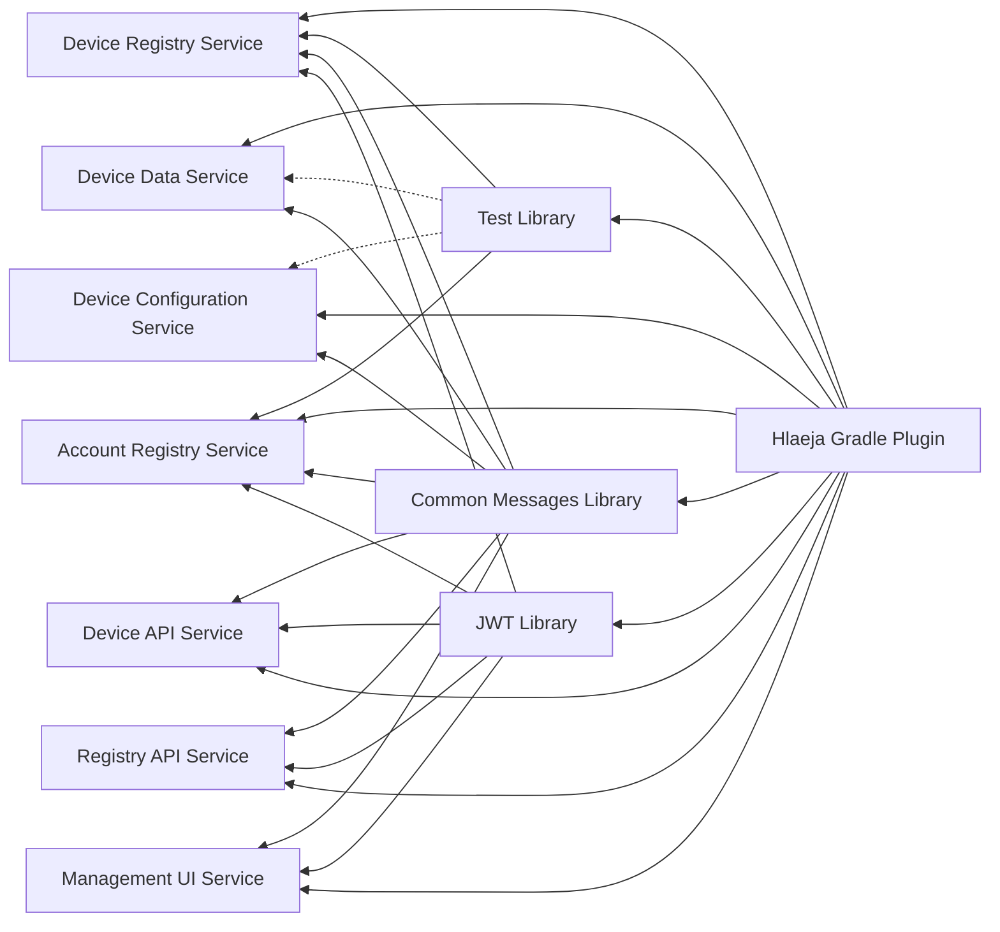

# Hlæja dependency

## Build Release Order

*need to make pipeline for this.*

Level 1

- hlaeja-version-catalog

Level 2

- hlaeja-core-plugin

Level 3

- hlaeja-common-plugin

Level 4

- hlaeja-common-messages
- hlaeja-jwt
- test-library

Level 5

- hlaeja-account-registry
- hlaeja-device-registry
- hlaeja-device-configuration
- hlaeja-device-data
- hlaeja-device-api
- hlaeja-registry-api
- hlaeja-management

## Service dependency

## Gradle Plugin Dependency

## Library And Gradle Plugin Dependency

