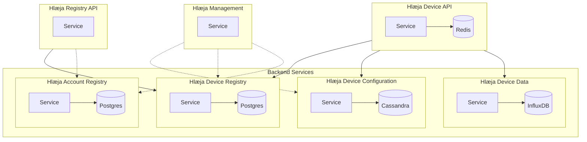
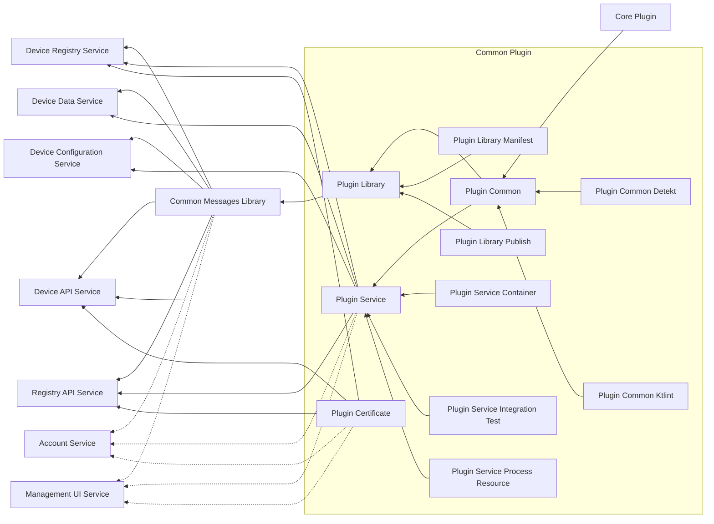

# Hlæja dependency

## Service dependency

```mermaid
graph TD
;
  subgraph BE[Backend Services]
    subgraph HDR[Hlæja Device Registry]
      HDRS[Service] --> HDRD[(Postgres)]
    end
    subgraph HDD[Hlæja Device Data]
      HDDS[Service] --> HDDD[(InfluxDB)]
    end
    subgraph HDC[Hlæja Device Configuration]
      HDCS[Service] --> HDCD[(Cassandra)]
    end
    subgraph HAR[Hlæja Account Registry]
      HARS[Service] --> HARD[(Postgres)]
    end
  end
  subgraph HDA[Hlæja Device API]
    HDAS[Service] --> HDAD[(Redis)]
  end
  subgraph HRA[Hlæja Registry API]
    HRAS[Service]
  end
  subgraph HM[Hlæja Management]
    HMS[Service]
  end

  HDA --> HDR
  HDA --> HDC
  HDA --> HDD
  HRA --> HDR
  HRA -.-> HAR
  HM -.-> HDC
  HM -.-> HDR
  HM -.-> HAR
```

## Library and Gradle plugin dependency

```mermaid
graph RL
;
  CP[Core Plugin]
  subgraph SCP [Common Plugin]
    PL[Plugin Library]
    PLM[Plugin Library Manifest]
    PLP[Plugin Library Publish]
    PCo[Plugin Common]
    PCoD[Plugin Common Detekt]
    PCoK[Plugin Common Ktlint]
    PS[Plugin Service]
    PSC[Plugin Service Container]
    PSIT[Plugin Service Integration Test]
    PSPR[Plugin Service Process Resource]
    PCe[Plugin Certificate]
  end
  PCo --> PL
  PLM --> PL
  PLP --> PL
  CP --> PCo
  PCoD --> PCo
  PCoK --> PCo
  PCo --> PS
  PSC --> PS
  PSIT --> PS
  PSPR --> PS
  CML[Common Messages Library]
  PL --> CML
  DRS[Device Registry Service]
  CML --> DRS
  PS --> DRS
  PCe --> DRS
  DDS[Device Data Service]
  CML --> DDS
  PS --> DDS
  DCS[Device Configuration Service]
  CML --> DCS
  PS --> DCS
  DAS[Device API Service]
  CML --> DAS
  PS --> DAS
  PCe --> DAS
  RAS[Registry API Service]
  CML --> RAS
  PS --> RAS
  PCe --> RAS
  AS[Account Service]
  CML -.-> AS
  PS -.-> AS
  PCe -.-> AS
  MUS[Management UI Service]
  CML -.-> MUS
  PS -.-> MUS
  PCe -.-> MUS
```
